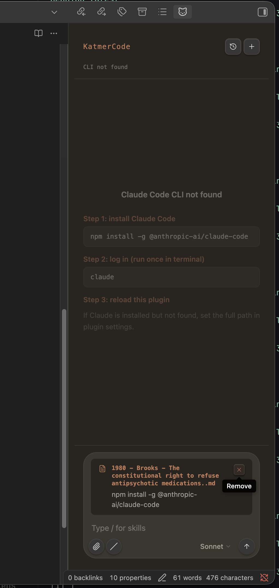

# Claude-Wrapping 계획 (AISidebar 전용)

> **저장 목적**: 미래 구현을 위한 아이디어 보관. 현재 결정 보류.

---

## 핵심 아이디어

BlockNote 에디터의 AI (AIExtension + Ollama transport)는 그대로 유지하고,
**우측 AISidebar만** Ollama → `claude` CLI 프로세스 래핑으로 교체한다.

```
BlockNote 에디터  ←→  Ollama (로컬, 그대로 유지)
AISidebar        ←→  claude CLI subprocess (Claude API, 전체 Skill 지원)
```



---

## 왜 이 방식인가

현재의 ollama based chatting pane은 claude skill을 쓸 수가 없다. 

### 실증된 사실 (직접 테스트 완료)

```bash
echo "hello" | claude -p --output-format stream-json
```

출력:
```json
{"type":"system","session_id":"74f7e76d-...","slash_commands":["scientific-writing","arxiv-database","literature-review", ...200+ skills]}
{"type":"assistant","message":{"content":[{"type":"text","text":"Hello!..."}]}}
{"type":"result","session_id":"...","total_cost_usd":0.07}
```

- `--output-format stream-json` → 구조화된 JSON 스트림, 파싱 쉬움
- `--resume <session_id>` → 멀티턴 대화 유지
- `--cwd <project_path>` → 프로젝트 디렉토리 컨텍스트
- `--bare` → 오버헤드 최소화 (skills는 여전히 작동)
- `slash_commands` 목록이 init 이벤트에 포함 → UI에서 자동완성 가능

---

## 아키텍처

```
[AISidebar - React]
  사용자 입력 → rpc.claudeStream(message, sessionId)
  aiChunk 메시지 수신 → 실시간 스트리밍 표시

        ↕ RPC (기존 채널 재활용)

[Bun main process - src/bun/]
  새 핸들러: claudeStream({ message, sessionId, projectPath })
    → Bun.spawn(["claude", "-p", message,
                 "--output-format", "stream-json",
                 "--resume", sessionId,   // 첫 턴은 생략
                 "--cwd", projectPath,
                 "--bare"])
    → stdout JSON 파싱
    → assistant 텍스트 청크를 aiChunk RPC 메시지로 renderer에 전송
    → result 이벤트에서 session_id 추출 → 다음 턴에 재사용
```

---

## 구현 범위

### 추가/변경 파일

| 파일 | 작업 |
|------|------|
| `src/bun/claude/client.ts` | **신규** — claude subprocess 관리, 세션 ID 추적, JSON 스트림 파싱 |
| `src/bun/index.ts` | `claudeStream` RPC 핸들러 등록 |
| `src/shared/scholar-rpc.ts` | `claudeStream` 요청 타입, `claudeChunk` 메시지 타입 추가 |
| `src/renderer/rpc.ts` | `claudeStream` 함수 추가 |
| `src/renderer/components/sidebar/AISidebar.tsx` | Ollama → claude 백엔드로 교체, `/` skill 자동완성 추가, `@` 파일 멘션 추가 |

### 유지 파일 (변경 없음)

| 파일 | 이유 |
|------|------|
| `src/bun/ollama/client.ts` | BlockNote AIExtension 에서 계속 사용 |
| `src/renderer/ai/ollama-transport.ts` | BlockNote AIExtension 에서 계속 사용 |
| `src/renderer/components/editor/EditorArea.tsx` | 변경 없음 |
| Ollama 상태 폴링 (`getOllamaStatus`) | 에디터 AI 상태 표시에 여전히 필요 |

---

## AISidebar 기능 변화

### `/` Skill 자동완성

1. `system` init 이벤트의 `slash_commands` 배열 → 세션 시작 시 캐시
2. 사용자가 `/` 입력 → dropdown에 skill 목록 표시 (필터링)
3. 선택 시 `/skill-name` 이 메시지로 전송됨
4. claude CLI가 해당 skill 실행 (tool use, web search 등 포함)

### `@` 파일 멘션

1. `@` 입력 → `rpc.listProjectFiles` 결과로 dropdown
2. 선택된 파일 내용을 메시지 컨텍스트에 주입
3. claude CLI는 `--cwd <project_path>` 로 프로젝트 파일에 직접 접근 가능

### 멀티턴 대화

```ts
let sessionId: string | null = null;
// 첫 턴: sessionId 없이 실행 → result에서 session_id 획득
// 이후 턴: --resume sessionId
```

---

## Bun 핵심 코드 스케치

```typescript
// src/bun/claude/client.ts

class ClaudeClient {
  async streamChat(
    message: string,
    sessionId: string | null,
    projectPath: string,
    onChunk: (text: string) => void,
    onDone: (newSessionId: string) => void
  ): Promise<void> {
    const args = [
      "claude", "-p", message,
      "--output-format", "stream-json",
      "--bare",
      "--cwd", projectPath,
    ];
    if (sessionId) args.push("--resume", sessionId);

    const proc = Bun.spawn(args, { stdout: "pipe", stderr: "pipe" });

    const reader = proc.stdout.getReader();
    const decoder = new TextDecoder();
    let buffer = "";

    while (true) {
      const { done, value } = await reader.read();
      if (done) break;
      buffer += decoder.decode(value, { stream: true });
      const lines = buffer.split("\n");
      buffer = lines.pop() ?? "";

      for (const line of lines) {
        if (!line.trim()) continue;
        try {
          const event = JSON.parse(line);
          if (event.type === "assistant") {
            const text = event.message?.content?.[0]?.text;
            if (text) onChunk(text);
          }
          if (event.type === "result") {
            onDone(event.session_id);
          }
        } catch {}
      }
    }
  }
}
```

---

## 비용 고려사항

- 첫 턴: 캐시 미스 → 비쌈 (테스트: $0.07 for "hello")
- 두 번째 턴~: `cache_read_input_tokens` 증가 → 크게 절감
- `--bare` 플래그: 불필요한 CLAUDE.md 로딩, hook 등 제거
- `--model haiku` 옵션으로 비용 절감 가능 (skill 작업에는 sonnet 권장)

---

## Skill 사용 가능 여부

`slash_commands` 목록이 `system` init 이벤트에 200개 이상 포함됨 (직접 확인).
`/scientific-writing`, `/arxiv-database`, `/literature-review` 등 학술 작업 관련 skill 다수 포함.
`claude -p "/skill-name ..."` 형태로 전달하면 Claude Code runtime이 해당 skill을 실행함.

---

## 향후 결정 포인트

- [ ] tool 실행 결과(파일 편집 등)를 AISidebar에서 어떻게 표시할 것인가?
- [ ] `--permission-mode` 설정 — `acceptEdits`(자동) vs `default`(확인 요청)?
- [ ] 비용 한도 `--max-budget-usd` 설정 여부
- [ ] Ollama 완전 제거 vs 병존 (현재 계획: 병존)
- [ ] Skill 실행 중 tool_use 이벤트 (중간 작업) UI 표시 여부
